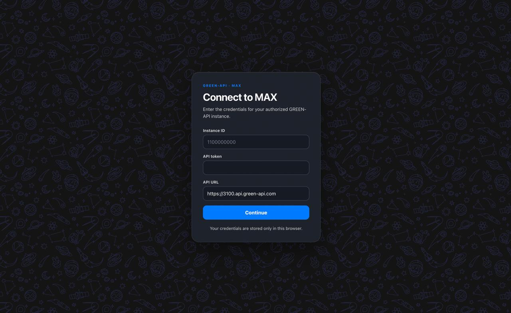

# Green Max Chat

A small React client for sending and receiving text messages through [GREEN-API](https://green-api.com/max) in MAX.



## Requirements

- Bun
- an authorized GREEN-API MAX instance
- a recipient phone number registered in MAX

## Setup

```sh
bun install
cp .env.example .env
```

Set only the public API base URL in `.env`:

```dotenv
PUBLIC_API_URL=https://api.green-api.com
```

Enter the instance ID and API token in the app. Do not put credentials in `.env` or source control.

Before testing notifications in GREEN-API:

1. Leave the custom `webhookUrl` empty; HTTP polling and webhook delivery are mutually exclusive.
2. Enable incoming message notifications.
3. Enable outgoing API message notifications if sent messages should appear in the queue.

## Run

```sh
bun run dev
```

Then open the local URL, sign in, enter a recipient phone number, and send a message.

## Verify

```sh
bun run check
```

This runs formatting, linting, typechecking, tests, and the production build.

## Routes

- `/login` — enter GREEN-API credentials
- `/join` — validate an international phone number and create a chat
- `/chat/:chatId` — send and receive text messages

## Architecture

- `src/api/` contains the typed GREEN-API client, schemas, and transport errors.
- `src/modules/` contains auth and chat behavior.
- `src/routes/` and `src/pages/` contain route policy and page composition.
- `src/test-support/` contains shared test fixtures.

## Security and scope

This is a client-side prototype. The API token is stored in browser `localStorage`; do not use this storage model in production without a backend, credential rotation, CSP, and a proper threat model.

Remote API URLs must use HTTPS. Plain HTTP is allowed only for loopback development hosts.

The app intentionally supports one text-only chat with in-memory session state. Media, groups, calls, history synchronization, and account management are out of scope.
